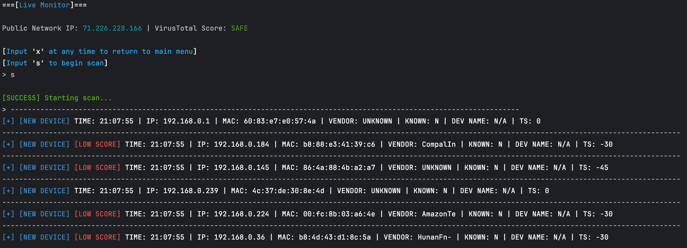

# NetPulse  
*A Python-based network monitoring and anomaly detection tool with trust scoring.*  

---

## 🚀 Overview  
NetPulse is a lightweight, Python-based **network monitoring tool** that detects new devices, MAC spoofing attempts, and anomalies on a local subnet. It assigns a **dynamic trust score** to each device using configurable JSON policies, helping analysts quickly identify potentially suspicious behavior.  

Think of it as a **mini SIEM for your LAN** — it collects logs, applies scoring logic, highlights anomalies, and stores scan history for audit and review.  

---

## ✨ Features  
- **Live Monitoring**: Continuously scan the local subnet for connected devices.  
- **Change Detection**: Detect new devices, MAC address changes, and trust score fluctuations in real time.  
- **Trust Scoring**: Assign scores to devices based on:  
  - Vendor trustworthiness (configurable)  
  - Device type classification (e.g., camera, laptop, Intel chipsets)  
  - MAC address analysis (valid vs. spoofed)  
  - Connection time (business hours vs. off-hours)  
- **Configurable Rules**: Scoring tables and trusted vendor lists are stored in external JSON files (`score_config.json`, `trusted_vendors_config.json`).  
- **Log Storage**: Export results and scan history to CSV for audit trails and further analysis.  
- **User Interface**: Simple terminal-based UI with color-coded alerts (using `colorama`).  

---

### Screenshots

