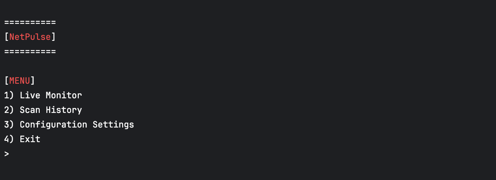
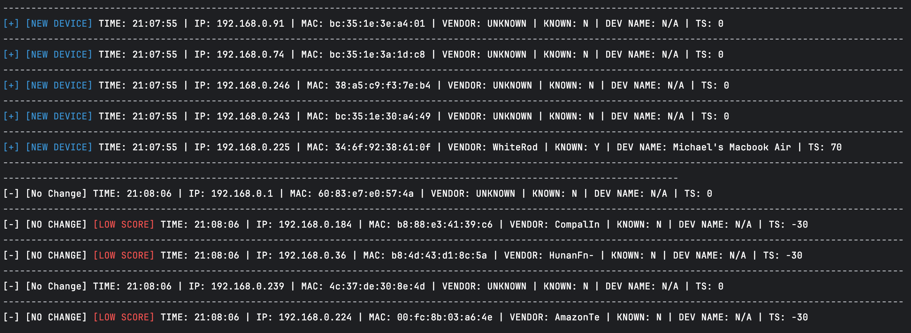
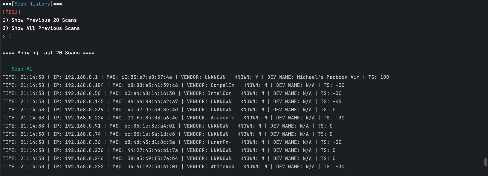

# NetPulse  
*A Python-based network monitoring and anomaly detection tool with trust scoring and VirusTotal API implentation*

---

## 🚀 Overview  
NetPulse is a lightweight, Python-based **network monitoring tool** that detects new devices, MAC spoofing attempts, and anomalies on a local subnet. It assigns a **dynamic trust score** to each device using configurable JSON policies, helping analysts quickly identify potentially suspicious behavior.  

Think of it as a **mini SIEM for your LAN**, it collects logs, applies scoring logic, highlights anomalies, and stores scan history for audit and review.  

---

## 🔑 Features  
- **Live Monitoring** – Continuously scans the local subnet for connected devices.  
- **Change Detection** – Flags new devices, MAC address changes, and trust score fluctuations in real time.  
- **Trust Scoring Engine** – Assigns a dynamic score to each device based on:  
  - Vendor trustworthiness (configurable in JSON)  
  - Device type classification (e.g., camera, laptop, Intel chipsets)  
  - MAC address validity (spoofed vs. legitimate)  
  - Connection time (business hours vs. off-hours)  
- **Configurable Policies** – External JSON files define scoring rules and trusted vendors for easy customization.
- **VirusTotal API Score** - VirustTotal API custom scoring if provided API key 
- **Color-Coded Alerts** – Terminal output highlights anomalies and low-trust devices for quick triage.  
- **Scan History** – Maintains a full history of previous scans for review.  
- **CSV Logging** – Exports scan results and trust scores for audits or further analysis.  
- **Lightweight & Portable** – Runs in any Python 3.x environment with minimal dependencies.  

---

## Screenshots
### Main Menu

### Live Scan

### Scan History

Updated scan history screenshot to include known device naming and scoring

